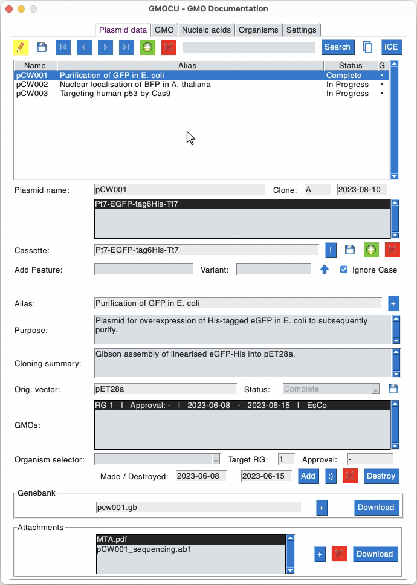

# GMOCU

User-oriented plasmid database with GMO documentation in accordance with the German GenTAufzV regulation (*Formblatt-Z*).



## Installation

### Download

Download executable GMOCU packages for macOS, Windows, and Linux from the [Releases](https://github.com/beyerh/gmocu/releases) page. See [video tutorial](#software-installation).

Alternatively, you may execute the ```gmocu.py``` script file containing the source code (requires installation of dependencies).

For instructions on installing a local instance of JBEI/ice (optional), see further below.

### Upgrade versions

Download the new [Release]([Releases · beyerh/gmocu · GitHub](https://github.com/beyerh/gmocu/releases)) and replace the previous version with it. GMOCU will resource the data from the [GMOCU user data folder](#where-is-all-data-stored) in the user directory and eventually update the database file structure. [Backup](#backup) your data before updating.

## Usage

### Video tutorials

Note: The video tutorials are based on GMOCU version 0.4 and do not reflect the current software state.

<details>
  <summary>Software download and installation</summary>
  <a name="software-installation"></a>
  <video src='https://github.com/beyerh/gmocu/assets/116307465/b80ad6e4-4eae-463d-b651-d45ecbe82d23.mp4' />
</details>

<details>
  <summary>Getting started and importing a glossary</summary>
  <a name="getting-started"></a>
  <video src='https://github.com/beyerh/gmocu/assets/116307465/2e7dbd91-90cc-4a8d-98df-a48982e77f64.mp4' />
</details>

<details>
  <summary>Data import from another GMOCU instance</summary>
  <a name="data-import"></a>
  <video src='https://github.com/beyerh/gmocu/assets/116307465/9a4d021a-7b93-4ed8-8109-c224b9d83e65.mp4' />
</details>

<details>
  <summary>Data entry</summary>
  <a name="data-entry"></a>
  <video src='https://github.com/beyerh/gmocu/assets/116307465/ffd65faf-d73d-4b53-9378-3890d2d044a9.mp4' />
</details>

<details>
  <summary>Configure JBEI/ice and upload part entries</summary>
  <a name="jbei-ice"></a>
  <video src='https://github.com/beyerh/gmocu/assets/116307465/e547da3b-d598-4b9e-9677-4a8074cc3feb.mp4' />
</details>

<details>
  <summary>Generating reports and retrieving attachments</summary>
  <a name="reports"></a>
  <video src='https://github.com/beyerh/gmocu/assets/116307465/e5b35398-446f-4a21-b0af-7332ecc5a837.mp4' />
</details>

### Settings

| Setting            | Description                                                                                                                                                                                                                                                                                                                     |
| ------------------ | ------------------------------------------------------------------------------------------------------------------------------------------------------------------------------------------------------------------------------------------------------------------------------------------------------------------------------- |
| Initials           | Define the user or project initials. Based on the entry, a folder on JBEI/ice will be generated into which plasmid entries will be uploaded. The initials should not and cannot be changed anymore at a later date.                                                                                                             |
| GMO institute      | Provides governmental information on the GMO facility (Az. and Anlage Nr.) which will appear on the Formblatt-Z.                                                                                                                                                                                                                |
| Server credentials | Generate an API key for a shared JBEI/ice account hosted locally or on the public server. Enter the key. Several accounts can be added to push plasmid data into multiple accounts if desired. See the [video tutorial](#getting-started). Enter [Filebrowser](https://filebrowser.org/) address and user/password information. |
| GDrive Sheet ID    | See [instructions](#initial-setup) on how to configure the Google Sheets support. Extract the Sheet ID from the link and enter it here. ```https://docs.google.com/spreadsheets/d/1QnyWcntaYdYkEqyUStWZedsb4ZKLsd18/edit#gid=1994557483```, Identifier: ```1QnyWcntaYdYkEqyUStWZedsb4ZKLsd18```                                 |
| GDrive Folder ID   | See [instructions](#initial-setup) on how to configure the Google Sheets support. Extract the Folder ID from the link and enter it here.                                                                                                                                                                                        |
| Style              | Visual theme.                                                                                                                                                                                                                                                                                                                   |
| Horizontal layout  | Layout option for small or low resolution screens.                                                                                                                                                                                                                                                                              |
| Duplicate GMOs     | When duplicating a selected plasmid, GMOs will also be copied, however, with the current date. (Default, false).                                                                                                                                                                                                                |
| Upload completed   | Only upload plasmid entries that were set to the status "Complete". (Default, false).                                                                                                                                                                                                                                           |
| Autosync GSheets   | Automatically synchronizes the online and local glossaries on startup and when new entries are being added (saved).                                                                                                                                                                                                             |
| Use JBEI/ice       | Enable uploading genebank files and plasmid data to the JBEI/ice instance defined in "Server credentials".                                                                                                                                                                                                                      |
| Use Filebrowser    | Enable uploading genebank files, attachments, and plasmid data to a local Filebrowser server defined in "Server credentials".                                                                                                                                                                                                   |
| Use GDrive Folder  | Enable uploading genebank files, attachments, and plasmid data to the Google Drive folder defined in "Settings".                                                                                                                                                                                                                |
| Zip files          | Zip files of each entry before uploading to Google drive resulting in a faster upload.                                                                                                                                                                                                                                          |
| Target organisms   | Define target organisms (working organisms for GMO generation). The organisms must first be present in the organism glossary.                                                                                                                                                                                                   |
| Fav. organisms     | Select some of the target organisms for generating several GMOs with one click using the ':)' convenience function. All organisms in ```Fav. organisms``` must be present in ```Target organisms```!                                                                                                                            |

### Where is all data stored?

All files written by GMOCU (including various exports and the ```gmocu.db``` SQLite database file) are located in the [GMOCU user data folder](#where-is-all-data-stored), residing in your home directory. Depending on the operating system, the location is:

macOS:
`/Users/<user>/GMOCU`

Windows:
`C:\Users\<user>\GMOCU`

Linux:
`/home/<user>/GMOCU`

### Glossaries

The ```Nucleic acids``` and ```Organisms``` glossaries can be imported and exported from and to ```*.xlsx``` files in the respective tabs. Use the provided templates located in your [GMOCU user data folder](#where-is-all-data-stored) to prepare the data for import. Glossaries can also be imported from an existing Google Sheet defined in the Settings ([See setup](#google-drive-and-google-sheets-integration)). One setup, use the ```Online sync``` button to download new entries, update and integrate changed entries, and upload new entries. See below for configuration instructions for the Google Sheets integration.

### Google Drive and Google Sheets integration

Google drive and Google Sheet integration can be used to upload files and maintain/synchronize common `Nucleic acids` and `Organisms` glossaries, respectively.

#### Initial setup

The initial setup is only required once <u>per team</u> and includes the following steps:

1) Create a Google Drive service account and download the credentials ```JSON``` file to your [GMOCU user data folder](#where-is-all-data-stored) with the file name ```gmocu_gdrive_credits.json```.

2) In your own Google Drive, create an empty folder and share it with the email address of the service account with 'Editor' permission.

3) In your own Google Sheets account, create an empty spreadsheet and share it with the email address of the service account with 'Editor' permission.

Detailed steps to create the Google service account:

- Log into the [Google Cloud Console](https://console.cloud.google.com/).

- Create a new project or choose an existing one.

- From the Menu, choose ```APIs and Services```. On the top, click on ```+ ACTIVATE APIs AND SERVICES``` and enable ```Google Drive API``` and  ```Google Sheets API```.

- From the Menu, choose ```IAM & Admin``` and click on ```Service accounts```. On the top, click on ```+ CREATE SERVICE ACCOUNT``` and fill the details (Name, ID, and Description).

- Set the role as ```Editor``` for the project.

- The button ```+ CREATE KEY``` appears at the bottom. Click it and choose ```JSON``` key type. Create the key and download the file to your [GMOCU user data folder](#where-is-all-data-stored) with the name ```gmocu_gdrive_credits.json```. Distribute the file to all team members.

Detailed steps share a common Google Drive Folder and Google Sheets glossary.

- As team head or administrator, create an empty Google Sheets spreadsheet and share it with the email address of the service account ('Editor' permission). You will find the email address in the ```gmocu_gdrive_credits.json``` file. Copy the sheet ID in the link of the spreadsheet and distribute it to team members. The ID may look similar to ```1NnDS5R7gZ0zMd_2079ht0zxKpz-Z-ds12yM75_85j6g```.

- Also, create an empty folder in your Google Drive and share it with the service account ('Editor' permission). Copy the folder ID at the end of the link and distribute it to team members. The ID may look similar to `1Tt0aEcq2jgxmWV44v0-quCdERqEs22nv`. 

#### Individual setup

Ensure to have the `gmocu_gdrive_credits.json` file in the [GMOCU user data folder](#where-is-all-data-stored) of all users. Enter the IDs of the Goole Sheet spreadsheet and the Google Drive folder in the Settings tab.

#### Shared Google Sheets Glossaries usage

With an empty Google Sheet, enter `Nucleic acids` and `Organisms` definitions in GMOCU or import them using the provided import templates (located in the [GMOCU user data folder](#where-is-all-data-stored)). Use the ```Sync online``` button to upload the data to the Google Sheet. On the first sync, the required sheets in the online file will be generated. When joining an existing glossary, simply configure the ID in the Settings and use the `Sync online` button to import them. <u>Do not import the data again using the template files.</u>

**Note on glossaries curation:** Local users can download and upload glossary definitions. Data can only be edited before they have been synced. It is not possible to delete or change them. However, curation by an administrator is possible. Changes can be made online in the Google Sheet spreadsheet. On the next sync, the changes will be applied locally <u>and propagated to all existing plasmid entries</u>. The administrator may set the ```valid``` flag to ```0```to remove entries from the glossaries for all users.

#### Shared Google Drive Folder usage

The JBEI/ice server serves data browsing in teams, however, attachments such as sequencing results and additional documents can not be attached programatically. Therefore, all data can be uploaded either to a Google Drive folder or to a Filebrowser folder (see below). If activated and configured in the Settings, all data will be stored in the GDrive subfolder with the name of the ```initials``` of the user (button in GMO tab).

#### Filebrowser support

**Note:** Filebrowser support does not apply to Windows users. Use the Google Drive implementation instead.

Upload plasmid genebank files and any files attached as "Attachement" together with a text file containing plasmid data in a folder tree to a local Filebrowser server (see below for server configuration). The address, user and password must be added in the Settings tab.

### Plasmid data

Enter plasmid data and GMOs in the ```Plasmid data``` tab. There are also functions for uploading Genebank plasmid maps and associated data. The plasmid maps will be added to JBEI/ice on upload. There are several convenient functions for adding GMO-relevant cassettes and GMO entries. Please import or enter ```Nucleic acids``` and ```Organisms``` glossaries and fill in all ```Settings``` before starting to add plasmid data. See [video tutorial](#data_entry).

### Example data

The `example` folder contains a pre-filled `gmocu.db` file with testing data. The file can be copied into the [GMOCU user data folder](#where-is-all-data-stored). If no `gmocu.db` file exists, GMOCU will generate an empty database file on the initial start.

A set of example `Nucleic acid` and `Organism` definitions is enclosed in the `templates` folder of the [GMOCU user data folder](#where-is-all-data-stored). It can be used to establish a first library of definitions and then be imported into GMOCU and further uploaded to the Google Sheets collection.

### GMO and Maintainance

#### Maintenance

Check for completeness of the glossaries and duplicates of plasmid entries.

#### JBEI/ice, Filebrowser, GDrive

Upload plasmid entries to the services configured in the Settings (JBEI/ice, local Filebrowser instance, Google Drive folder). Each upload will overwrite the information on the server. Another way to update the information of a individual plasmid entries, e.g. after editing, is by pressing the ```UP``` button in the top right corner of the ```Plasmid data``` tab. See the [video tutorial](#jbei-ice).

#### GMO

Generate a simple ```Plasmid list``` or the ```Formblatt Z``` biosafety report required for governmental regulations. Also, export the ```Nucleic acids``` and ```Organisms``` in the respective tabs. The files will appear in the [GMOCU user data folder](#where-is-all-data-stored).

#### Data import

Import data from another ```gmocu.db``` file together with the associated nuclei acid features and organisms if they are not yet present in the glossary of the app. This function is useful for combining data from several users into one database file. See the [video tutorial](#data-import).

### Backup

To backup the database it suffices to copy the ```gmocu.db``` SQLite database file located in the [GMOCU user data directory](#where-is-all-data-stored). The file contains all relevant data. Alternatively you may backup the entire GMOCU folder. It is possible to store the ```gmocu.db``` file at a location which is synced via a cloud service such as Dropbox. Then, replace the file in the application folder with a soft link to that file. That way, one can work with the same database from different computers. Regular backups are recommended.

### Manual data editing

The data stored in tables within the `gmocu.db` file can be accessed by software such as [DB Browser for SQLite](https://sqlitebrowser.org/). While we generally recommend refraining from manual editing, it might be required in particular cases.

### Link to the public registry JBEI/ice database

Create a free account at the [JBEI public registry](https://public-registry.jbei.org/). Generate an access token in the account settings and add it in the GMOCU settings tab. Note that you may not be able to delete entries again from the registry. Alternatively, install a local JBEI/ice instance (recommended, [see below](#install-jbeiice-as-docker-container-locally-or-on-a-server)).

### Hidden settings

### Specify scaling and font size and reset OS-dependent detection

In the Settings tab, the fields for defining font size and scaling are inactivated (grayed out). Enable them by pressing the key combination ```Ctrl + e```. Now you can specify the values and save. Restart GMOCU.

In order to reset the OS-dependent automated setting of the font size and scaling values, enter ```__``` (double underscore) into the fields and save. Close GMOCU and delete the file ```gmocu.json``` in the project directory. Restart GMOCU.

## Install JBEI/ice as docker container locally or on a server

- For reference, see [the official description](https://github.com/JBEI/ice/tree/trunk/docker).

- Install Docker Desktop, and set startup after login in settings.

- Set static IP in Network Settings and change the computer name for network access via ```name.local```.

- Clone repo:
  
  ```bash
  git clone https://github.com/beyerh/gmocu.git
  ```

- Copy modified docker-compose.yml containing PASSWORD fix and autostart:
  
  ```bash
  mkdir ice
  cp gmocu/docker-compose.yml ice/
  cd ice
  ```

- Either enter the static IP address set above into the docker-compose.yml file:
  
  ```yaml
  134.99.70.14:9999:8080
  ```
  
  or leave the address as localhost for installation on a local machine without network access:
  
  ```yaml
  127.0.0.1:9999:8080
  ```

- Install JBEI/ice from the docker hub, create containers, and launch:
  
  ```bash
  docker pull jbei/ice
  docker-compose up
  ```

- Call the address set above in a browser and log in with "Administrator" as user and password.

- Create a new user account and setup the access token to use in the GMOCU settings.

### Install Filebrowser on server

For uploading files including attachments, a [Filebrowser](https://filebrowser.org/) server can be used (e.g. on the same computer running the jBEI/ice server). The installation is very simple (see homepage for instructions for Windows):

```
curl -fsSL https://raw.githubusercontent.com/filebrowser/get/master/get.sh | bash
```

Initiate the Filebrowser instance with:

```bash
filebrowser config init -r /path/to/folder/on/server -a 134.99.70.14
```

Replace the IP address with the static IP of your server or skip ``` -a ip-address``` if you would like to run the server on localhost. Start on boot with ```filebrowser```.

### Possible backup solution for JBEI/ice docker volumes

Install [docker-vackup](https://github.com/BretFisher/docker-vackup).

Script the following commands and execute them e.g. daily. Include the tarballs into your regular backup solution:

```bash
cd ~/ &&
/usr/local/bin/vackup export ice_ice_home ice_ice_home.tar.gz &&
/usr/local/bin/vackup export ice_ice_index ice_ice_index.tar.gz &&
/usr/local/bin/vackup export ice_postgres_db ice_postgres_db.tar.gz
```

You may execute the the backup commands via an automator app on macOS (this requires including the `PATH` variable in the script `PATH=$PATH:/usr/local/bin`) and schedule with the calendar app. Alternatively a corn job executed as user might work. Other backup strategies are possible.

## Development

### Anaconda development environment and deployment of executables

With [Anaconda](https://www.anaconda.com/) installed, add the conda-forge repository:

```python
conda config --add channels conda-forge
conda config --set channel_priority strict
```

Set up the developmental ```gmocu``` environment:

```python
conda create --name gmocu python=3.9
conda activate gmocu

conda install PySimpleGUI pandas Pillow xlsxwriter openpyxl gspread python-levenshtein PyDrive2
pip install icebreaker pyinstaller filebrowser-client gspread-dataframe
```

Deploy executable using Pyinstaller:

```python
conda activate gmocu
pyinstaller gmocu.spec
```

For the macOS build with the current version of pyinstaller (```pyinstaller-6.7.0```) you will have to move the ```Download``` folder and the ```gmcocu.sql``` file from ```GMOCU.app/Contents/Resources``` to ```GMOCU.app/Contents/MacOS```. On Windows and Linux, the two items have to be moved form the ```_internal``` folder to the ```gmocu``` folder.

### Modifying the information content of the generated reports

Customized reports can be generated by modifying the respective functions in the ```gmocu.py``` file. Data can be sourced from the various tables and fields stored in the SQLite file ```gmocu.db```. For an overview, see the content of the file ```gmocu.sql```.

For biosafety reports, the relevant function to modify is called ```generate_formblatt(lang)```. Here, under the section ```#pack data```, the content can be defined which subsequently has to be inserted into the pandas data frame at the end of the function.

Plasmid lists can be modified within the function ```generate_plasmidlist()```, following the same concept as with biosafety reports.

Formatting parameters such as column widths of the generated output ```*.xslx``` file can be defined in the ```while``` loop where the functions are called.

## Resources

- [Wagner C, Urquiza-Garcia U, Zurbriggen MD, Beyer HM. GMOCU: Digital Documentation, Management, and Biological Risk Assessment of Genetic Parts. Adv Biol (Weinh). 2024 Jan 23:e2300529.](https://pubmed.ncbi.nlm.nih.gov/38263723/)
- [PySimpleSQL](https://github.com/PySimpleSQL)
- [PySimpleGUI](https://github.com/PySimpleGUI/PySimpleGUI)
- [ICEbreaker](https://edinburgh-genome-foundry.github.io/icebreaker/)
- [Filebrowser-client](https://github.com/chermed/filebrowser-client)
